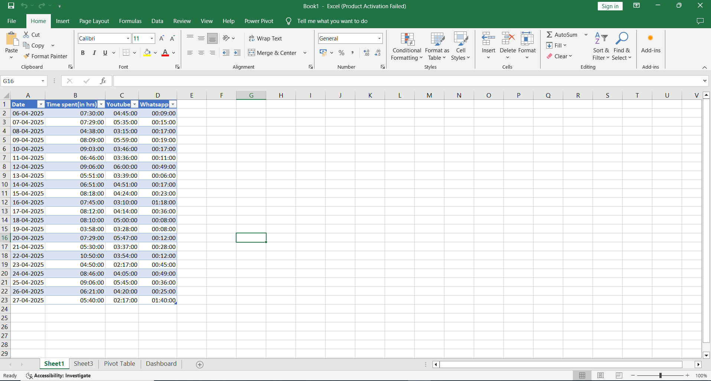
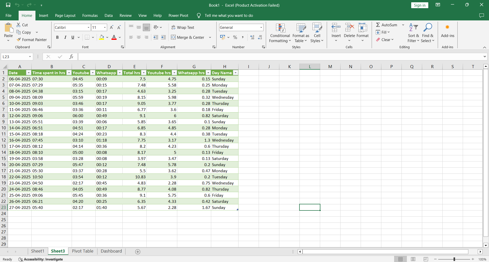
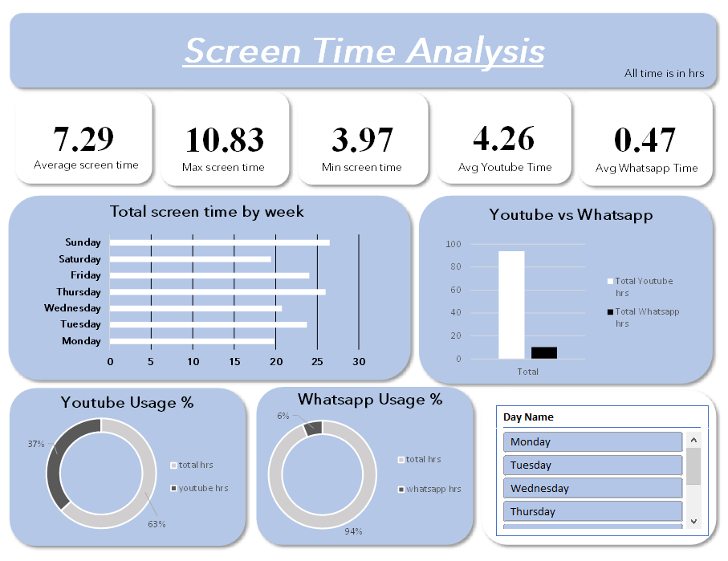

# 📱 Screen Time Analysis Dashboard

I analyzed my personal smartphone screen time data using Excel to visualize how I spend my day — and the results were shocking! 

## Tools Used
- Excel (Data Cleaning + Dashboard)
- Power Query
- Basic formulas (HOUR, MINUTE)
- Data Visualization techniques

## Data Cleaning
**Raw Data**

- Converted all time into hours for consistency
- Rounded small minute values carefully (WhatsApp usage looked tiny otherwise!)
- Made sure data for each day of the week was organized properly.

**Clean Data**

## Dashboard Features
- Average, Maximum, Minimum Screen Time Cards
- Daily Screen Time Chart
- App Usage Comparison (YouTube vs WhatsApp)
- Dynamic filters by Day of the Week

## Key Findings
- Average screen time: 7.29 hours/day
- Maximum screen time: 10.83 hours
- YouTube consumption: 63% of total screen time

## Detailed Analysis
1. General Screen Time Behavior
- Average daily screen time is around 7.29 hours — this is quite high and could indicate heavy phone usage daily.
- Max screen time on a single day was 10.83 hours, and Min screen time was 3.97 hours.
- This suggests that even on low-usage days, I am spending about 4 hours on the phone minimum.

2. Platform Usage Split
YouTube dominates the screen time:
- YouTube Average Time = 4.26 hrs/day → ~58% of daily screen time!
- WhatsApp usage is comparatively very low:

WhatsApp Average Time = 0.47 hrs/day (~28 minutes) which is only about 6% of total time.

👉 Conclusion:
- YouTube is the main driver of screen time. WhatsApp is almost negligible in comparison.

3. Day-wise Screen Time
From the Total screen time by week bar chart:
- My screen time is fairly consistent across days.
- Sunday and Saturday seem to have slightly higher usage (logical because of weekend free time).

👉 Conclusion:
There is no huge spike on any particular day — my screen time habits are regular throughout the week, with a small bump on weekends.

4. Platform Comparison Visualization
In the YouTube vs WhatsApp chart:

YouTube’s total hour bars are much larger compared to WhatsApp.

👉 Conclusion:
Most of the productive (or unproductive) time opportunity lies in managing YouTube consumption, not WhatsApp.

5. Usage % Donut Charts
YouTube Usage %:
YouTube takes around 63% of total screen time.

📉 WhatsApp Usage %:
WhatsApp takes only about 6% of total screen time.

👉 Conclusion:
Any effort to reduce screen time should primarily target YouTube usage.

## Learnings
- Data tells the truth we often avoid.
- Visualizing habits makes them impossible to ignore.
- Small tracking projects = Big life changes.

---

### Data Source
Personal smartphone settings ➔ Screen Time Export

---

If you liked this project, feel free to star the repo!
